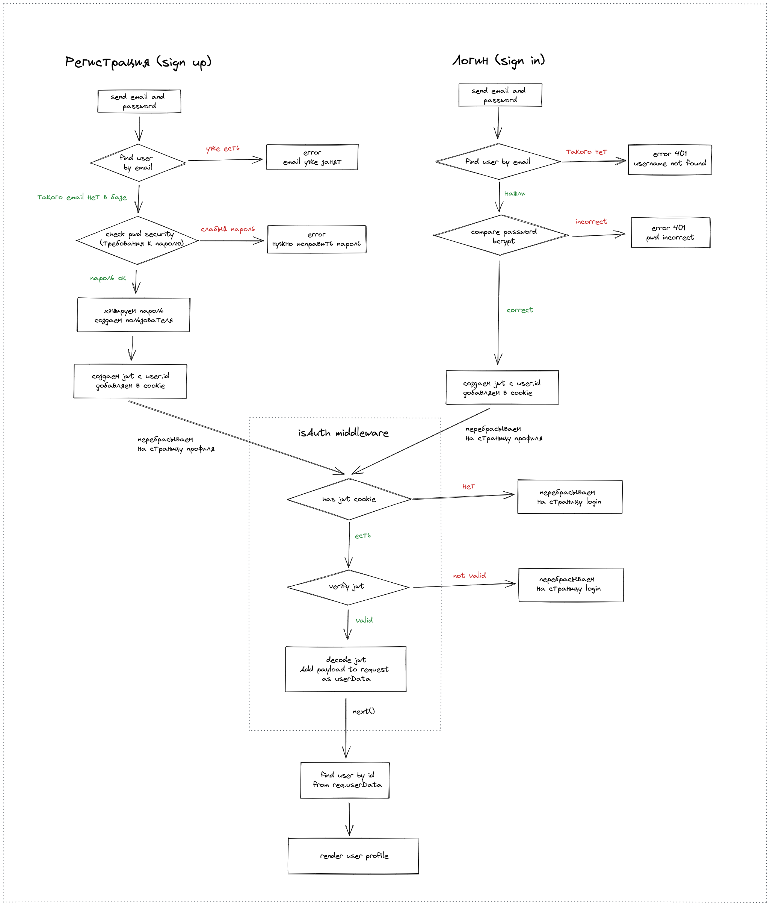

# Простая авторизация пользователей

Тестовый (образовательный) проект, архитектура приложения, базовые принципы аутентификации/авторизации (без использования сторонних сервисов и библиотек)

## Техническое задание

* Express, база данных MongoDB, ODM Mongoose
* Шаблонизатор Nunjucks, layouts, минимальное оформление
* Регистрация пользователя (sign up), авторизация (sign in, login), выход (logout)
* На главной выводится список всех пользователей
* Без подтверждения email (данный функционал не реализован)
* Пароли при сохранении в БД хэшируются (bcrypt)
* Используется только Access Token (без Refresh Token)
* JWT хранится в cookies
* Доступ к профилю только авторизованному пользователю, только к своему профилю
* Страницы регистрации и входа для авторизованного пользователя недоступны, редирект на профиль
* Отправка данных через обычную форму (`application/x-www-form-urlencoded`), без JS and AJAX
* Обработка ошибок

Схема аутентификации/авторизации - на рисунке:

## Комментарии

Файл `.env` добавлен в учебных целях, в production, конечно, так делать нельзя

## TODO

* Сделать выход из системы (logout)
* На главной скрывать ссылки на логин и регистрацию, если авторизован, добавлять кнопку выйти
* Ограничение времени жизни токена
* Время жизни куки
* Добавить строгую валидацию входящих данных (email, password) (`express-validator` или `joi`)

## Feedback

Писать на почту - dmitriy.tka4@gmail.com
